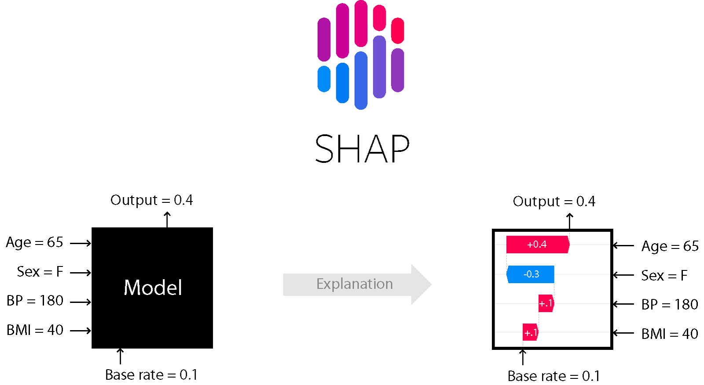

### Setup environment

Before we start the introduction of the project, let's load all the required packages and code in the background:

```{julia}
@info "Preparing environment..."

## This activates our environment (not needed for CODESPACES)
##using Pkg
##Pkg.activate(abspath(@__DIR__, ".."))

# This loads all required packages:
import LinearAlgebra: diag
import Random
import Plots
import Lux

# set working directory
cd("/workspaces/2026-page-workshop-materials/02_deep_comp_neural_ODEs_julia/hands-on")

include(joinpath("..", "src", "data", "load.jl"));
include(joinpath("..", "src", "model", "helpers.jl"));
include(joinpath("..", "src", "model", "hybrid-ude.jl"));

using ShapML
using Functors
using DeepCompartmentModels
# This sets the default look for plots:
Plots.default(framestyle=:box, tickdirection=:out)
```

### Tobramycin case-study

The dataset used in this workshop (`tobr-simulation.csv`) is simulated based on the clinical data and findings from the key population pharmacokinetics study by *Aarons et al. (1989)*, titled **"Population pharmacokinetics of tobramycin"** (you can find the original paper under `00_data/paper`).

#### Goal of the Study

Tobramycin is an aminoglycoside antibiotic widely used to treat severe infections caused by gram-negative bacteria. Due to its narrow therapeutic index, it requires careful dosing: achieving sufficiently high peak concentrations is critical for clinical efficacy, while minimizing prolonged exposure to high concentrations is vital to avoid serious side effects such as nephrotoxicity and ototoxicity.

The primary objectives of the original study were to:

1.  Estimate population pharmacokinetic (PK) parameters and quantify inter- and intra-subject variability.
2.  Evaluate the impact of patient covariates, particularly renal function and body weight, on these PK parameters.
3.  Establish *a priori* dosing recommendations that account for varying degrees of renal function impairment to achieve target therapeutic concentrations safely.

#### Patient Population

The study utilized clinical data from a heterogeneous group of **97 patients** (45 female, 52 male) requiring routine tobramycin monitoring. Key demographic data for the cohort included:

-   **Age**: Mean 50.6 years (ranging from 16 to 85 years).
-   **Body Weight**: Mean 66.5 kg (ranging from 42 to 120 kg).
-   **Renal Function**: Estimated creatinine clearance (CLcr) ranged widely from 10 to 166 mL/min (mean 67.9 mL/min), representing patients with both normal and significantly impaired renal function.

#### Study Setup

The analysis was conducted using real-world, routine therapeutic drug monitoring (TDM) data:

-   **Regimens**: Multiple-dose regimens, with the duration of therapy spanning from 14 to 520 hours.
-   **Sampling**: A total of **322 tobramycin concentration measurements** were taken, with between 1 and 9 samples per individual.
-   **Sampling Times**: Typically drawn 2 and 6 hours after dosing in patients with normal renal function, with additional measurements at 12 and 24 hours for patients with impaired renal function to accurately capture slow elimination dynamics.

In the provided dataset (`tobr-simulation.csv`), we simulate this setup, retaining the relationship between covariates (such as `age`, `wt` for weight, `sex`, and `crcl` for creatinine clearance) and drug concentrations (`dv`) across various dosing records (`amt`).

### Loading data set

We'll start off loading our data set in julia and storing all relevant information in a `Population` object.

```{julia}
# The below helper function loads the data into a Population object:
population = load_data(); 
# The resulting population contains the following covariates: 
# [wt, age, sex, crcl]
get_x(population)
```

------------------------------------------------------------------------

## Part one: Deep Compartment Models

### Model definition

We'll start off with defining a Deep Compartment Model (DCM). This model class has two main components:

-   An *Encoder*, which maps covariates $\mathbf{X}$ to a set of latent parameters $\mathbf{z}$ (e.g. the PK or PD parameters).
-   A *system of differential equations* (usually a system of Ordinary Differential Equations; ODE) to run a simulation of the underlying mechanistic model to reproduce the observations $y_t$ based on those parameters.

For the encoder, we'll use a relatively simple feed-forward neural network. For the ODE, we'll use a simple two-compartment model. This means our neural network will predict the following parameters: $\left[\mathrm{CL}, \mathrm{V}_1, \mathrm{Q}, \mathrm{V}_2\right]$.

The DeepCompartmentModels package uses Lux.jl to make it easier for users to define Neural Networks. Lux.jl divives parameters into learnable (`ps`) and fixed parameters (the state `st`). If the model contains stochasticity, this behaviour can be controlled trough the state, so that each forward pass over the model represents a deterministic operation given a specific `st`. The use of a `st` object also is a great way to seperate out learnable and fixed parameters to reduce the

We'll normalize the inputs to sit roughly within the interval \[0,1\] before passing them to the neural network. This removes scaling differences between the inputs which generally makes it easier for the model to learn.

We use a `softplus` activation function in the final `Dense` layer to ensure our PK parameter predictions are positive.

Finally, we pass an `InitialScale` layer to scale the model output to a reasonable initialisation of the parameters.

```{julia}
num_x = size(get_x(population), 1) # this grabs the number of covariates in X
init = [5., 30., 1., 1.] # [cl, v1, q, v2] in mg/dL

# This defines our encoder model. The function call for hidden layers in Lux.jl is: Lux.Dense(in, out, activation). The Normalize and InitialScale helper functions are defined in DeepCompartmentModels.jl
encoder = Lux.Chain(
    Normalize([150., 100., 1., 180.]),
    Lux.Dense(num_x, 12, Lux.swish),
    Lux.Dense(12, 12, Lux.swish),
    Lux.Dense(12, length(init), Lux.softplus),
    InitialScale(init)
) 
```

Next, we'll define the actual DCM. For this, we also need to define an `ErrorModel`. The DeepCompartmentModels package ships with the following options:

-   `AdditiveError`: $y = \hat{y} + \epsilon$
-   `ProportionalError`: $y = \hat{y} * \epsilon + 1e-5$
-   `CombinedError`: $y = \hat{y} + \epsilon_1 + \hat{y} * \epsilon_2$
-   `CustomError`: Allows the user to define a custom error model (for example to include covariate effects).

Let's start with a simple `AdditiveError`:

```{julia}
# We'll use a simple additive error model with an initial estimate of 0.1.
error = AdditiveError(0.1)

# We'll use a two compartment model, the `target` keyword identifies the index of the compartment corresponding to the DV.
dcm = DeepCompartmentModel(two_comp!, encoder, error; target = 1)
```

### Optimisation setup

Before we can start optimisation, we need to select an objective function, as well as initialise the parameters and the optimiser.

With respect to the objective function, we'll focus on three options:

-   `MSE()`: Minimizes the mean squared error. Essentially optimises the fixed effects parameters of the neural network only. Ignores the `ErrorModel`.
-   `LogLikelihood()`: Maximises the loglikelihood of a Gaussian distribution. Optimises the fixed effects parameters of the neural network and the residual error parameters.
-   `VariationalELBO(idxs)`: Maximises the evidence lower bound (ELBO). Uses Variational Inference to optimise variational posteriors over random effects for each subject in the data set alongside fixed effect parameters. The `idxs` argument identifies the indexes in the parameter vector $\mathbf{z}$ for which to include random effects. The default behaviour is to add random effects using $\mathbf{z} = f(x) * \exp(\eta)$.

The DeepCompartmentModels package also exports a `LogLikelihood` objective that optimises fixed-effect parameters alongside `ErrorModel` parameters.

```{julia}
rng = Random.Xoshiro(42) # Set the random seed

objective = MSE() # or LogLikelihood()
ps, st = setup(objective, rng, dcm) # initialise parameters

# The below uses the VariationalELBO to perform mixed-effect estimation, we'll do this later.
idxs = [1] # random effect on z[1]
objective = VariationalELBO(idxs)
ps, st = setup(objective, rng, dcm, population)

# We use the Adam optimiser with a learning rate of 0.01. You can also experiment with different optimisers. For example, AdamW is step-by-step becoming the default.
learning_rate = 0.01
opt = Optimisers.Adam(learning_rate)
# We store the state of the optimiser in a dedicated object. For Adam, this object for example contains information about the current momentum parameters.
opt_state = Optimisers.setup(opt, ps)
;
```

### Compiling functions

The next step is to compile the main functions and to check if everything runs smoothly. Especially the initial run of the gradient function might take some time.

```{julia}
@info "Compiling relevant functions..."
predict(dcm, population, ps, st)
objective(dcm, population, ps, st)
gradient(objective, dcm, population, ps, st)
;
```

### Optimisation

Now we are ready to start optimisation of the model. Let's define the training loop manually so you can see what is going on:

```{julia}
num_epochs = 500

losses = Float32[]
for epoch in 1:num_epochs
    if objective isa VariationalELBO
        # Optimise omega every 50 steps after epoch = 100
        if epoch >= 100 && epoch % 50 == 0
            print("Optimizing omega... ")
            Accessors.@reset ps.omega = optimise_omega(ps)
            println("ω = $(sqrt.(diag(ps.omega))))")
        end
        update_epsilon!(rng, st)
    end
    # Calculate the loss:
    loss = objective(dcm, population, ps, st)
    push!(losses, loss)
    println("Epoch $epoch, loss = $loss")
    # Calculate the gradients for the current parameters:
    grad = gradient(objective, dcm, population, ps, st)
    # Update the parameters and optimiser state:
    opt_state, ps = Optimisers.update(opt_state, ps, grad)
end

# After training, we can plot the loss to see if the model has converged:
loss_minimization = Plots.plot(losses)
display(loss_minimization)
```

We see that the loss decreases nicely during training.

Now let's take a look at how our model performed.

1.  We'll start by generating a Goodness-of-fit (GOF) plot:

```{julia}
# This produces predictions at the time of each DV:
yhat = predict(dcm, population, ps, st)

gof = Plots.scatter(get_y(population), yhat, color=:lightblue, label=nothing)
Plots.plot!(gof, [-1, 30], [-1, 30], color=:black, label=nothing) # Add line of identity
Plots.plot!(xlabel="Observed (mg/dL)", ylabel="Prediction (mg/dL)")

display(gof)
```

When using the `MSE` objective, we can see that there is quite a bit of prediction error. This can be expected, seeing as we are only optimising fixed effects.

2.  Let's also take a look at the median PK parameter estimates (if we are not using `MSE` we can also print the residual error and diagonal elements in the omega matrix):

```{julia}
# zeta are the typical PK parameter estimates for each individual.
zeta, _ = dcm.model(get_x(population), ps.theta, st.theta)

df = DataFrame(parameter = ["clearance", "volume of distribution", "intercompartmental clearance", "peripheral volume"], median = vec(median(zeta, dims=2)), std = vec(std(zeta, dims=2)))

# Add rows for the residual error:
if :error in keys(ps)
    tmp = DataFrame(
        parameter = ["residual error $i" for i in eachindex(ps.error.σ)], 
        median = Lux.softplus.(ps.error.σ), 
        std = zeros(length(ps.error.σ))
    )
    append!(df, tmp)
end

# Add rows for the random effect prior variance (standard deviation):
if :omega in keys(ps)
    tmp = DataFrame(
        parameter = ["omega $i (std)" for i in eachindex(diag(ps.omega))], 
        median = sqrt.(diag(ps.omega)), 
        std = zeros(size(ps.omega, 1))
    )
    append!(df, tmp)
end

df
```

3.  Next, we'll take a look at some of the individual predictions and residuals. Let's first generate full concentration-time curves for each individual by using the predict function:

```{julia}
# Setting interpolate = true and target = false returns a DESolution object, which represents the full concentration-time curve over the observation window.
sols = predict(dcm, population, ps, st; interpolate = true, target = false)
;
```

Next, we'll actually plot the prediction (You can keep running the below cell to generate a plot for a different subject):

```{julia}
i = rand(rng, eachindex(population))
individual = population[i]
sol_i = sols[i]

# We'll plot the solution of the ODE as well as the individual DVs:
top = Plots.plot(sol_i, label=["Central compartment" "Peripheral compartment"])
Plots.scatter!(top, individual.t, individual.y, label="Observations")
Plots.plot!(top, title=individual.id, xlabel="", ylabel="Concentration (mg/dL)")

# Let's grab the predictions for the individual at the time of each DV. We can get this by calling the sol object with a set of time points:
yhat = sol_i(individual.t)[1, :]
residuals = (individual.y - yhat)
# When using LogLikelihood or VariationalELBO, we can also use the cwres:
# Σ = error(yhat, ps.error, st.error)
# cwres = residuals ./ sqrt.(diag(Σ))

# Let's plot the residuals or cwres as well:
bottom = Plots.hline([0], color=:black, ribbon=0.5, fillalpha=0.075, linestyle=:dash, label=nothing)
Plots.scatter!(bottom, individual.t, residuals, label=nothing) # You could swap residuals here for cwres if you want.
Plots.plot!(bottom, ylim=(-2, 2), xlabel="Time since start admission (hours)", ylabel="Residuals")

# Plots.grid is a helper function to create layouts for multiple plots: Plots.grid(rows, cols, ...)
plt = Plots.plot(top, bottom, layout=Plots.grid(2, 1, heights=[0.6, 0.4]))

display(plt)
```

### Model evaluation

We can see that there is still quite a bit of error for most of the subjects. There are a couple of things we can do at this point. One option is to improve the model itself, for example by adding random effects or changing the error model.

To do this, we can go back to the cells where we have defined our model and make the following changes:

-   `error = CombinedError([0.1, 0.1])`.
-   `objective = VariationalELBO(idxs)`.
-   `learning_rate = 0.1` (we recommend increasing the learning rate when using mixed-effect estimation).

If you are happy (or at least happier) with the model, let's continue to the model explanation / interpretation section.

------------------------------------------------------------------------

## Part two: Model explanation / interpretation

Now that we have a model that we are at least somewhat comfortable with, let's move on to the second part of this workshop: model explanation / interpretation.

There is a subtle but important distrinction between these two concepts:

-   Explanation: Understanding how the model came to its output.
-   Interpretation: Understanding how the model operates internally.

There has been a big boom in research to develop algorithms to help explain machine learning model output. These techniques help deconstruct model predictions and create an implicit representation of how the model came to its specific output for a given input. One popular method used for this purpose is SHapley Additive exPlanations (SHAP). We won't go into details of how this algorithm works exactly, but know that is essentailly deconstructs each prediction into a simpler additive model:



Model interpretation operates under a stricter definition. In this context, we know exactly what the model is doing, which is for example the case for simple linear models. This is understandably a more complex target to achieve for black-box models such as neural networks. However, we'll show that we can redefine our neural network in such a way that predictions become **inherently interpretable**.

1.  Let's start by using SHAP to explain the output of our learned encoder:

```{julia}
# The ShapML package expects a DataFrame as input, so let's create it from our population object:
covariates = [:wt, :age, :sex, :crcl]
df = population_to_df(population; covariates)
explain_idx = 1 # Index in z to explain. 1 corresponds to clearance.
num_samples = 60 # Number of Monte Carlo samples. A higher number results in more accurate estimates but higher computational demands

shap = ShapML.shap(
    explain = df,
    model = encoder,
    predict_function = (model, data) -> shap_predict(model, data, ps, st; explain_idx),
    sample_size = num_samples,
    seed = 42
)

# This plots a table with the shap_value for each of the data examples:
show(shap, allcols = true)
```

Let's rank the covariates based on importance by calculating the mean absolute shap value over all data examples:

```{julia}
# The shap_values are organised per feature, so let's group these together:
covariate_effects = groupby(shap, :feature_name)

# We then calculate mean absolute shap values for each of the covariates:
mean_abs_shap_values = Float32[]
for group in covariate_effects
    push!(mean_abs_shap_values, mean(abs.(group.shap_effect)))
end


importance = Plots.bar(mean_abs_shap_values, orientation=:horizontal, label=nothing)
Plots.plot!(
    importance, 
    yticks = (eachindex(covariates), covariates), # yticks takes (values, label names)
    title="Covariate importance for explaining z[$(explain_idx)]"
)

display(importance)
```

We can not only list the relative importance of each covariate, but we can also plot the shap value for the each of the covariate values, giving us a rough idea about the relationship between the covariate and the specific PK parameter. Let's do this for `crcl`:

```{julia}
covariate = "crcl"
shap_values = shap[shap.feature_name .== covariate, :shap_effect]
Plots.scatter(df[:, covariate], shap_values)
```

You can try to repeat the above procedures for different indexes in z, and for different covariates to see what kind of relationships the model has learned. After having played around with this we can move on to running an interpretable model:

2.  Let's redefine our encoder to follow a multi-branch architecture, which results in a fully interpretable model:

```{julia}
interpretable_encoder = Lux.Chain(
    Normalize([150., 100., 1., 180.]),
    Lux.BranchLayer(
        # A MultiHeadedBranch takes in the following inputs: covariate_idx, number of neurons in hidden layer, number of outputs.
        wt = MultiHeadedBranch(1, 6, 4; activation = Lux.swish),    # weight (x[1]), 6 neurons, 4 outputs -> linked to all PK parameters
        age = MultiHeadedBranch(2, 6, 4; activation = Lux.swish),   # age (x[2]), 6 neurons, 4 outputs -> linked to all PK parameters
        sex = MultiHeadedBranch(3, 1, 2; activation = Lux.swish),   # sex (x[3]), 1 neuron (categorical), 2 outputs
        crcl = SingleHeadedBranch(4, 12; activation = Lux.swish)    # crcl (x[4]), 12 neurons. SingleHeadedBranch has only a single output
    ),
    # Now that we have a bunch of outputs per covariate, we need to specify the actual indexes in z we are linking them to:
    Combine(length(init),
        1 => [1, 2, 3, 4],  # Add the effect of wt (idx 1) on z[1, 2, 3, 4]
        2 => [1, 2, 3, 4],  # Add the effect of age (idx 2) on z[1, 2, 3, 4]
        3 => [1, 2],        # Add the effect of sex (idx 3) on z[1, 2] (= clearance & volume of distribution)
        4 => [1]            # Add the effect of crcl (idx 4) on z[1] (= clearance)
    ),
    InitialScale(init)
)

# We create a DeepCompartmentModel as before:
interpretable_dcm = DeepCompartmentModel(two_comp!, interpretable_encoder, error; target = 1)
```

Now we run the parameter setup:

```{julia}
rng = Random.Xoshiro(42) # Set the random seed

objective = MSE() # or LogLikelihood()
ps_interpret, st_interpret = setup(objective, rng, interpretable_dcm)

learning_rate = 0.01
opt = Optimisers.Adam(learning_rate)
opt_state = Optimisers.setup(opt, ps_interpret)
;
```

and function compiling:

```{julia}
@info "Compiling relevant functions..."
predict(interpretable_dcm, population, ps_interpret, st_interpret)
objective(interpretable_dcm, population, ps_interpret, st_interpret)
gradient(objective, interpretable_dcm, population, ps_interpret, st_interpret)
;
```

### Optimisation

We run the same optimization loop as before:

```{julia}
num_epochs = 250

losses = Float32[]
for epoch in 1:num_epochs
    if objective isa VariationalELBO
        # Optimise omega every 50 steps after epoch = 100
        if epoch >= 100 && epoch % 50 == 0
            print("Optimizing omega... ")
            Accessors.@reset ps_interpret.omega = optimise_omega(ps_interpret)
            println("ω = $(sqrt.(diag(ps_interpret.omega))))")
        end
        update_epsilon!(rng, st_interpret)
    end
    # Calculate the loss, make sure to use the correct model, parameters, and state (e.g. those for the interpretable model):
    loss = objective(interpretable_dcm, population, ps_interpret, st_interpret)
    push!(losses, loss)
    println("Epoch $epoch, loss = $loss")
    # Calculate the gradient:
    grad = gradient(objective, interpretable_dcm, population, ps_interpret, st_interpret)
    opt_state, ps_interpret = Optimisers.update(opt_state, ps_interpret, grad)
end

loss_minimization = Plots.plot(losses)
display(loss_minimization)
```

Now that the model is optimised, we can run the `interpret_branch` helper function to plot the learned effect for a specific branch:

```{julia}
covariate = :crcl
explain_idx = 1

# The interpret helper function essentially passes a bunch of dummy inputs through a specific Branch in the model and records the output:
x, effect = interpret(interpretable_dcm, covariate, explain_idx, ps_interpret, st_interpret)

# If we know the inputs and outputs, we can plot the relationship between them, exposing exactly what the model is doing:
Plots.plot(x, effect, xlabel="Covariate value", ylabel="Fold change in z[$explain_idx]")
```

Here, we can see that we can use a multi-branch network to visualise the actual function relationships between each of the covariates and each of the PK parameters. This allows to to directly infer the internal function of the model and thus gives us a clear idea what the model is doing!

------------------------------------------------------------------------

## Part three: NeuralODEs

If you have been keeping a close eye on the model residuals, you might have noticed that are potentially relevent time-related biases in the prediction. The clearance of drugs that are primarily renally excreted such as tobramycin is significantly influenced by kidney function. In the critically ill, kidney function is known to depict significant variability during admission, and we might be able improve model performance by learning to capture this variability.

It is however likely that this variability is highly subject-specific. This means we would have to design subject-specific latent functions, and this would require significant effort using standard pharmacometric tool.

One class of models that can help us in these scenarios are NeuralODEs.

### Model definition

DeepCompartmentModels.jl exports a `HybridModel` type, which allows users to use neural networks to learn universal differential equations (UDEs). This model has the following components:

-   A `HybridModel` containing:
    -   An `Encoder`; same as before, this component learns a mapping from the covariates to a set of parameters for the differential equation.
    -   A `NeuralODE`: a model that outputs a set of partial derivatives that can be used in a universal differential equation.
-   A `UniversalDiffEq`: This represents the differential equation function that is used. Here, the user can define the components learned by the NeuralODE, the parameters learned by the Encoder, as well as the 'known' parts of the differential equation.

Let's start by defining the `HybridModel`. In our context, we would like to have the `NeuralODE` learn to represent the change in clearance based on the current time point $t$. As before, learning is simplified if we normalise its value to lie between 0 and 1.

```{julia}
# We use a relatively basic single hidden layer neural network.
node = Lux.Chain(
    Normalize([360.]),
    Lux.Dense(1, 32, Lux.swish),
    Lux.Dense(32, 1, Lux.softplus) # We want outputs to be positive so we use a softplus activation in the final layer.
)

hybrid = HybridModel(
    length(init), # Number of PK parameters
    encoder, # we use the same encoder from before
    node # The NeuralODE.
)
```

Next up is the definition of the UniversalDiffEq. This slightly more involved but let's go through it step by step:

1.  First, we define the number of partial differential equations in the UDE. Here, we select `num_partials = 2` for a central and peripheral compartment.

2.  Next, we define our `UniversalDiffEq`. This constructor takes the number of partial derivatives, as well as the type of UDE. We select a `CustomUDE` with a new `:two_comp_var` name.

3.  Now the model will look for a function for a UniversalDiffEq with the :two_comp_var name. None exists yet, so we will have to create one. We can do this with the following function signature:

`(::UniversalDiffEq{P,T})(model, u, p, t) where {P,T<:CustomUDE{StaticSymbol{:my_name}}}`

The UniversalDiffeq type is always called with:

-   `model`; this is automatically set to HybridModel.node internally
-   `u`: a vector of the current concentration in each compartment,
-   `p`: the parameters for the model. These are internally set to an Array containing the following fields:
    -   `p.latents`: Encoder output.
    -   `p.node`: NeuralODE parameters.
    -   `p.I`: treatment intervention.
-   `t`: the current time point.

This is how that would look like:

```{julia}
num_partials = 2

# The symbol in the CustomUDE (:two_comp_var) needs to match ...
node_prob = UniversalDiffEq(num_partials; type = CustomUDE(:two_comp_var))

# ... the type passed to this call -> CustomUDE{StaticSymbol{:two_comp_var}} <-
function (::UniversalDiffEq{P,T})(model, u, p, t) where {P,T<:CustomUDE{StaticSymbol{:two_comp_var}}} 
    cl₀, v₁, q, v₂ = p.latents # the encoder output for a single individual
    cl_t = model([t;;], p.node) # the change in `cl` at time `t`. Input needs to be a Matrix hence why we use [t;;] to transform t into a 1x1 matrix.
    cl = cl₀ * only(cl_t) # the current clearance is the baseline times the learned change at t

    # From here on out, we define a regular two compartment model:
    k₁₀ = cl / v₁
    k₁₂ = q / v₁
    k₂₁ = q / v₂
    
    # This is a standard two compartment model:
    return [
        p.I / v₁ - (k₁₀ + k₁₂) * u[1] + k₂₁ * u[2],
        k₁₂ * u[1] - k₂₁ * u[2]
    ]
end

# Now we define our new dcm:
dcm_node = DeepCompartmentModel(node_prob, hybrid, dcm.error; target=dcm.target)
```

### Parameter initialisation

We again initialise the parameters using the setup function. We'll use the `copy_over_previous_weights` helper function to initialise the parameter state at the state of our previous trained model:

```{julia}
# Here we load the MSE, but make sure to use the same objective function as used for the previous model, since we will be initialising the hybrid model where we left off:
objective = MSE()
ps_node, st_node = setup(objective, rng, dcm_node)

# idxs = [1]
# objective = VariationalELBO(idxs)
# ps_node, st_node = setup(objective, rng, dcm_node, population)
# We initialise this model using the parameters from the previous model:
ps_node = copy_over_previous_weights(ps => ps_node)
```

### Optimising subject-specific NeuralODEs

Since NeuralODEs are a fixed effect model, the learned dynamics will be the same for all individuals in our population. We however want these to be subject-specific, meaning that we have to optimise a NeuralODE for each subject in our data set. We can grab the parameters for a single individual using the following functions:

```{julia}
i = 1
individual = population[i:i]
# If you are using VariationalELBO, we need to make sure we only collect the random effects for individual i. We can do this with the take_batch helper.
ps_i, st_i = take_batch(ps_node, st_node, i:i)

opt_i = Optimisers.Adam(0.01)
opt_i_state = Optimisers.setup(opt_i, ps_i)

# Note that we will freeze the parameters for the encoder as well as other parameters. If we do not do this, we will update the encoder's parameters based on the data for only a single subject.
Optimisers.freeze!(opt_i_state.theta.encoder)
if :omega in keys(opt_i_state)
    Optimisers.freeze!(opt_i_state.omega)
end
if :error in keys(opt_i_state)
    Optimisers.freeze!(opt_i_state.error)
end
```

### Function compilation

You know the drill, let's compile the relevant functions:

```{julia}
predict(dcm_node, individual, ps_i, st_i)
objective(dcm_node, individual, ps_i, st_i)
gradient(objective, dcm_node, individual, ps_i, st_i)
```

### Optimise!

```{julia}
losses_i = Float32[]
for epoch in 1:250
    if objective isa VariationalELBO
        update_epsilon!(rng, st_i)
    end
    # Calculate the loss:
    loss = objective(dcm_node, individual, ps_i, st_i)
    push!(losses_i, loss)
    println("Epoch $epoch, loss = $loss")
    # and the gradient:
    grad = gradient(objective, dcm_node, individual, ps_i, st_i)
    opt_i_state, ps_i = Optimisers.update(opt_i_state, ps_i, grad)
end

# If the scale of the plot is off, you can use ylim=(y1, y2) to zoom into specific regions
Plots.plot(losses)
```

```{julia}
individual = population[i]

# Let's make predictions with both our new NeuralODE and original model:
sol = predict(dcm_node, individual, ps_i, st_i; interpolate = true, target = false);
sol_orig = predict(dcm, individual, ps, st; interpolate = true, target = false);

# Here we will plot the prediction from the NeuralODE model:
top = Plots.plot(sol, label=["Central compartment" "Peripheral compartment"])
Plots.scatter!(top, individual.t, individual.y, label="Observations")
Plots.plot!(top, title=individual.id, xlabel="", ylabel="Concentration (mg/dL)")

yhat = sol_orig(individual.t)[1, :]
yhat_time_var = sol(individual.t)[1, :]
residuals = (individual.y - yhat)
residuals_time_var = (individual.y - yhat_time_var)
# When using LogLikelihood or VariationalELBO, we can also use the cwres:
# Σ = error(yhat, ps.error, st.error)
# cwres = residuals ./ sqrt.(diag(Σ))
# cwres_time_var = residuals_time_var ./ sqrt.(diag(Σ))

# Similar to before, we plot the residuals. You can opt for cwres when you also optimise the error model parameters.
bottom = Plots.hline([0], color=:black, ribbon=0.5, fillalpha=0.075, linestyle=:dash, label=nothing)
Plots.scatter!(bottom, individual.t, residuals, color=:lightgrey, label="Original predictions")
Plots.scatter!(bottom, individual.t, residuals_time_var, color=:salmon, label="NeuralODE")
Plots.plot!(bottom, ylim=(-4, 4), xlabel="Time since start admission (hours)", ylabel="Residuals")

plt = Plots.plot(top, bottom, layout=Plots.grid(2, 1, heights=[0.6, 0.4]))

display(plt)
```

From the plots we can see that the addition of a NeuralODE reduces the time-related bias in the residuals. Nice!

Since the NeuralODE is again just a function mapping a single input to a single output, we can visualise the learned effect:

```{julia}
# The interpret_node helper function essentially inputs dummy time points and records the NeuralODE output, allowing us to check what it is doing.
t, effect = interpret_node(dcm_node, ps_node, st_node; t_dummy=0:individual.t[end])


bottom_eff = Plots.plot(t, effect, label=nothing)
Plots.plot!(bottom_eff, xlabel = "Time since start admission", ylabel="Fold change in clearance")

Plots.plot(top, bottom_eff, layout=(2, 1))
```

### Conclusion

And that is where we end the workshop! If we would continue with this project, we would create a training loop to learn a NeuralODE model for each of the subjects and use the corrected predictions to re-estimate the parameters for the encoder, or the residual parameters.