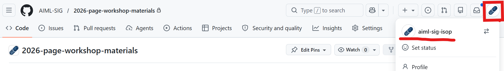
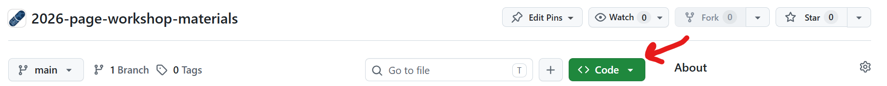
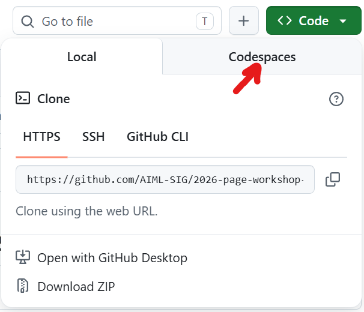
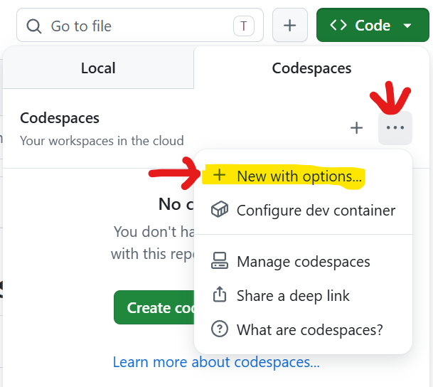
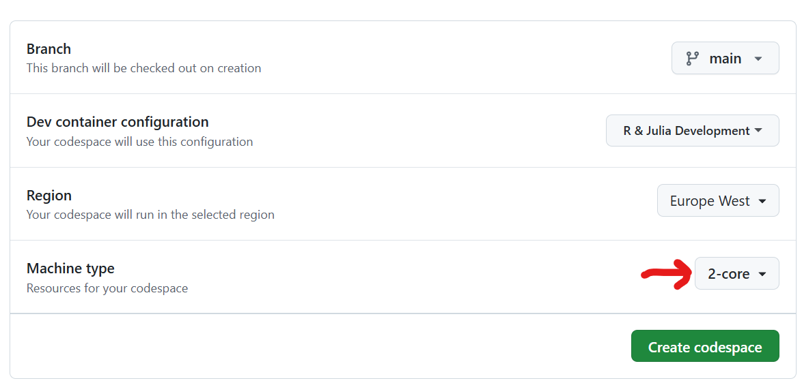
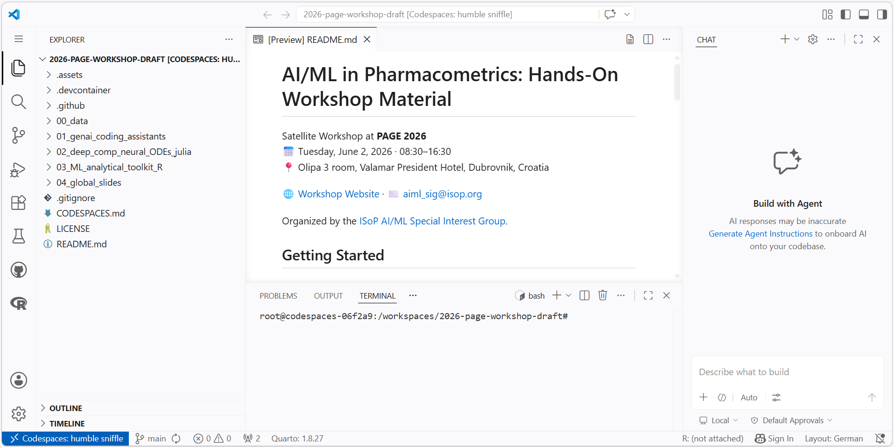
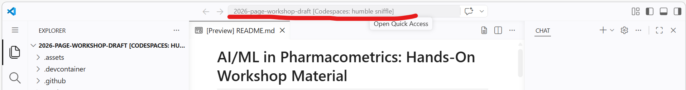
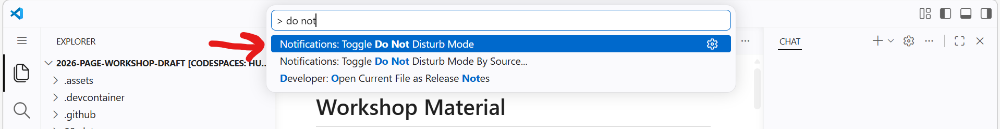

# How to Launch GitHub Codespaces

This guide walks you through the steps to launch and set up GitHub Codespaces for your project.

## Prerequisites

- To have a GitHub account
- Go to [GitHub.com](https://github.com) and sign in to your account
- You should see your profile like the following:

## Step-by-Step Guide

### Step 1: Click the Code Button

1. Click the green **Code** button located near the top of the repository
2. A dropdown menu will appear with several options

### Step 3: Select Codespaces Tab

1. In the dropdown menu, click on the **Codespaces** tab
2. You'll see options to create a new codespace or view existing ones

### Step 4: Create a New Codespace

1. Click the **`...`** menu next to the **Create codespace on main** button
2. Select **New with options**

3. Under **Machine type**, change from the default 2-core to **4-core** or **8-core**

4. Click **Create codespace** green button — GitHub will begin provisioning your environment

### Step 5: Wait for Initialization

1. Your codespace is now launching in a new browser tab
2. You'll see the VS Code interface loading
3. Extensions and dependencies will install automatically
4. Loading may take up to 10 minutes.

### Step 6: Set Do Not Disturb Mode

1. Once the codespace is fully loaded, click on the top bar

2. Enter `> do not disturb` from the menu, do not forget about the `>` symbol.

3. Select **Notifications: Toggle Do not Disturb Mode** to prevent notifications while working

### Step 7: Start Working

1. Now you have a complete development environment ready
2. You can open terminals, create files, and run commands
3. Your changes are automatically synced to your branch

## Managing Your Codespaces

### Stopping a Codespace

1. In the Codespaces dashboard, find your codespace
2. Click the three-dot menu next to it
3. Select **Stop codespace**

### Deleting a Codespace

1. In the Codespaces dashboard, hover over a codespace
2. Click the delete (trash) icon
3. Confirm the deletion
